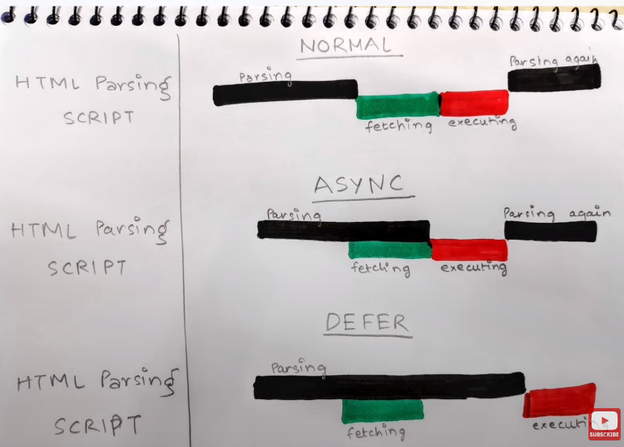

#### what is Emmet?
- Emmet is a set of plug-ins for text editors that allow for high-speed coding and editing in HTML, XML, XSLT, and other structured code formats via content assist . we can create our own Emmet in vs code .

#### Difference between a Library and Framework?
- Library is some set of code that is written by some developer and we are using react is a library . A framework, on the other hand, is a more comprehensive set of tools and conventions for building and organizing code. A framework provides a structure for developing a specific type of application, and it defines the way that the different parts of the application should interact with each other.Angular is a Framework

- react toastify , babel , crypto all is library that we use in react js 

####  What is CDN? Why do we use it?
A CDN, or Content Delivery Network, is a system of distributed servers that deliver web content to users based on their geographic location. CDN will serve the content from the server that is closest to the user's location, which can help to reduce the time it takes for the content to be delivered.

#### Why is React known as React?
React is known as React because it was designed to be a reactive library for building user interfaces. In software development, the term "reactive" refers to the idea of building applications that can automatically update and change in response to changes in data or user interaction.

#### what is crossorigin in script tag?
- The crossorigin attribute is used in the HTML script element to indicate that the script should be loaded from an external server in a different origin. This allows the browser to make a CORS (Cross-Origin Resource Sharing) request to the server to ask if it is okay to use the script. The server can then respond with the appropriate CORS headers to indicate whether or not the script should be loaded.

#### What is diference between React and ReactDOM

- React and ReactDOM both is diffrent library that is used to developed react application 
- React Contacains code for components and functionality like 
useState , useEffect , how to change Tree and render element with some optimization
- ReactDOM is used for creating root rendering inside dom      manupalating dom etc..

#### What is difference between react.development.js and react.production.js files via CDN?

The react.development.js file is the version of React that is intended for use during the development of an application. It includes helpful warnings and error messages, and it is generally easier to debug than the production version.

The react.production.js file, on the other hand, is the version of React that is intended for use in a production environment. It has been optimized for performance, with code that has been minified and stripped of debugging information. This makes it smaller and faster than the development version, but it can be harder to debug if there are issues with the application.

#### What is async and defer?
- let's understand what happens if we don't write async and defer 
- as shown in image black is for html , green is for fetching script and red is for exicuting script 
- so as browser start reading html if it encounter script tag it stops parsing html and fetch script and exicute then again start parsing script

- in async and defer you can understand from below image 
- defer will excute all script after parsing whole html file.

-